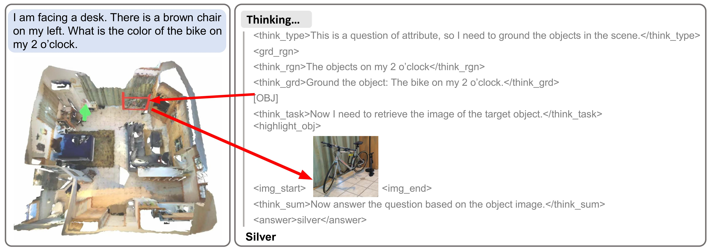

<h2 align="center">
  <span></span><b>SceneCOT: Eliciting Chain-of-Thought Reasoning in 3D Scenes</b>
</h2>

<div align="center" margin-bottom="6em">
<a target="_blank" rel="external nofollow noopener" href="https://xiongkunlinghu.github.io/">Xiongkun Linghu</a>,
<a target="_blank" rel="external nofollow noopener" href="https://huangjy-pku.github.io/">Jiangyong Huang</a>,
<a target="_blank" rel="external nofollow noopener" href="https://scholar.google.com/citations?user=Zhh8nbQAAAAJ&hl=en">Ziyu Zhu</a>,
<a target="_blank" rel="external nofollow noopener" href="https://buzz-beater.github.io/">Baoxiong Jia</a>,
<a target="_blank" rel="external nofollow noopener" href="https://siyuanhuang.com/">Siyuan Huang</a>
</div>
&nbsp;

<div align="center">
    <a href="https://arxiv.org/abs/2510.16714" target="_blank" rel="external nofollow noopener">
    </a>
    <a href="https://scenecot.github.io/" target="_blank" rel="external nofollow noopener">
    </a>
    <a href="https://github.com/SceneCOT/scenecot" rel="external nofollow noopener" target="_blank">
    </a>
</div>
&nbsp;
<div align="middle">

</div>
<b>SceneCOT</b>: We propose a Chain-of-Thought reasoning method in 3D scenes (SceneCOT), decoupling a complex reasoning task into simpler and manageable problems, and building corresponding visual clues based on multimodal expert modules. To our knowledge, this is the first attempt to successfully implement the COT technique for achieving human-like step-by-step reasoning for 3D scene understanding, where we show great potential in extending it to a wider range of 3D scene understanding scenarios.

### SceneCOT Framework
<div align="middle">

</div>
SceneCOT achieves great performance on MSQA, and Beacon3D, demonstrating the effectiveness of our reasoning framework. Especially, our method significanlty enhances the performance on counting, the most challenging task in MSQA. Our method also significanlty outperforms previous methods by a large margin in Beacon3D.


## 🔥 News
- \[2025-6\] We released the [webpage](https://scenecot.github.io/) of SceneCOT.

## 📝 TODO List

- [ ] Arxiv paper
- [ ] Evaluation code
- [ ] Model weights
- [ ] SceneCOT-185K dataset
- [ ] Training code


## BibTex
If you find our work helpful, please consider citing us:
```bibtex
@article{linghu2025scenecot,
  title={SceneCOT: Eliciting Grounded Chain-of-Thought Reasoning in 3D Scenes},
  author={Linghu, Xiongkun and Huang, Jiangyong and Zhu, Ziyu and Jia, Baoxiong and Huang, Siyuan},
  journal={arXiv preprint arXiv:2510.16714},
  year={2025}
}
```
