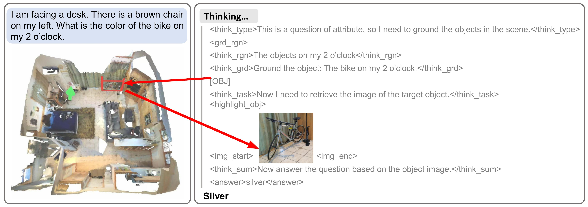

<h2 align="center">
  <span></span><b>SceneCOT: Eliciting Grounded Chain-of-Thought Reasoning in 3D Scenes</b>
</h2>

<h3 align="center">
ICLR 2026
</h3>

<div align="center" margin-bottom="6em">
<a target="_blank" rel="external nofollow noopener" href="https://xiongkunlinghu.github.io/">Xiongkun Linghu</a>,
<a target="_blank" rel="external nofollow noopener" href="https://huangjy-pku.github.io/">Jiangyong Huang</a>,
<a target="_blank" rel="external nofollow noopener" href="https://scholar.google.com/citations?user=Zhh8nbQAAAAJ&hl=en">Ziyu Zhu</a>,
<a target="_blank" rel="external nofollow noopener" href="https://buzz-beater.github.io/">Baoxiong Jia</a>,
<a target="_blank" rel="external nofollow noopener" href="https://siyuanhuang.com/">Siyuan Huang</a>
</div>
&nbsp;

<div align="center">
    <a href="https://arxiv.org/abs/2510.16714" target="_blank" rel="external nofollow noopener">
    </a>
    <a href="https://scenecot.github.io/" target="_blank" rel="external nofollow noopener">
    </a>
    <a href="https://huggingface.co/datasets/EricLHK/SceneCOT/tree/main" rel="external nofollow noopener" target="_blank">
    </a>
    <a href="https://huggingface.co/EricLHK/SceneCOT/tree/main" rel="external nofollow noopener" target="_blank">
    </a>
</div>
&nbsp;
<div align="middle">

</div>
<b>SceneCOT</b>: We propose a Chain-of-Thought reasoning method in 3D scenes (SceneCOT), decoupling a complex reasoning task into simpler and manageable problems, and building corresponding visual clues based on multimodal expert modules. To our knowledge, this is the first attempt to successfully implement the COT technique for achieving human-like step-by-step reasoning for 3D scene understanding, where we show great potential in extending it to a wider range of 3D scene understanding scenarios.

### SceneCOT Framework
<div align="middle">

</div>
SceneCOT achieves great performance on MSQA, and Beacon3D, demonstrating the effectiveness of our reasoning framework. Especially, our method significanlty enhances the performance on counting, the most challenging task in MSQA. Our method also significanlty outperforms previous methods by a large margin in Beacon3D.


## 🔥 News
- \[2026-3\] We release training code
- \[2026-1\] SceneCOT is accepted by ICLR 2026
- \[2025-6\] We released the [webpage](https://scenecot.github.io/) of SceneCOT

## 🚀 Get Started

1. Clone the repository.
```shell
git clone https://github.com/SceneCOT/scenecot
cd scenecot
```

2. Create a Python environment and install dependencies.
```shell
conda create -n scenecot python=3.9
conda activate scenecot

# PyTorch (example tested version)
conda install pytorch==2.4.1 torchvision==0.19.1 torchaudio==2.4.1 pytorch-cuda=11.8 -c pytorch -c nvidia

# project dependencies
pip install -r requirements.txt
```

3. Install point-cloud third-party modules.
```shell
pip install spconv-cu118

cd model/pointnetpp
python setup.py install
cd ../..

# sanity check
python -c 'from model.pointnetpp.pointnetpp import PointNetPP'
```

If `PointNext` build/import fails, either disable `PointNext` usage or place the compiled file from [LEO_data](https://huggingface.co/datasets/huangjy-pku/LEO_data/blob/main/pointnet2_batch_cuda.cpython-39-x86_64-linux-gnu.so) under `model/pointnext/cpp/pointnet2_batch/`.

## 🔧 Reproducibility configuration

The configs were updated to avoid machine-specific absolute paths. We recommend setting the following environment variables:

| Variable | Purpose | Default |
|---|---|---|
| `SCENECOT_EXP_ROOT` | experiment output root (`cfg.base_dir`) | `./outputs` |
| `HF_HOME` | Hugging Face cache root (`cfg.hf_home`) | `./.cache/huggingface` |
| `SCENECOT_LLM_PATH` | LLaVA model path or HF model id | `liuhaotian/llava-v1.5-7b` |
| `SCENECOT_VISION_TOWER_PATH` | CLIP vision tower path or HF model id | `openai/clip-vit-large-patch14-336` |
| `SCENECOT_POINTNET_TOKENIZER_PATH` | PQ3D PointNet++ tokenizer checkpoint | empty |
| `SCENECOT_QUERY3D_PRETRAIN_PATH` | Query3D/SceneVerse pretrain checkpoint | empty |

Example:
```shell
export SCENECOT_EXP_ROOT=/path/to/experiments
export HF_HOME=/path/to/hf_cache
export SCENECOT_LLM_PATH=liuhaotian/llava-v1.5-7b
export SCENECOT_VISION_TOWER_PATH=openai/clip-vit-large-patch14-336
```

## 📦 Pretrained weights

To reproduce paper-level performance, the following checkpoints are needed:

1. SceneCOT experts (released): [SceneCOT model repo](https://huggingface.co/EricLHK/SceneCOT/tree/main)
2. PQ3D PointNet++ tokenizer (`pointnet_tokenizer.pth`) → set `SCENECOT_POINTNET_TOKENIZER_PATH`
3. Query3D/SceneVerse pretrain (`pytorch_model.bin`) → set `SCENECOT_QUERY3D_PRETRAIN_PATH`

If 2/3 are unset, related modules are initialized without those pretrained weights, which may significantly affect final metrics.

## 🌐 External services

### Weights & Biases

Tracking is enabled by default. For evaluation-only/offline runs without login:
```shell
export WANDB_MODE=disabled
```

### Hugging Face access

If direct access to `huggingface.co` is restricted, set a mirror endpoint and keep a local cache:
```shell
export HF_ENDPOINT=https://your-hf-mirror
export HF_HOME=/path/to/hf_cache
```

## 📁 Data preparation

1. Download released dataset assets from [SceneCOT dataset](https://huggingface.co/datasets/EricLHK/SceneCOT/tree/main).
2. Download released checkpoints from [SceneCOT models](https://huggingface.co/EricLHK/SceneCOT/tree/main).
3. Ensure 3D point-cloud assets required by your selected task/evaluator are present (for PQ3D-based runs, missing point cloud files will break full reproduction).

## 🕹 Training and evaluation

Training:
```shell
sh scripts/train/full_training_msqa_gqa3d.sh
```

Evaluation (MOE test script):
```shell
sh scripts/test/full_training_msqa_beacon3d_test_moe.sh
```

## 📊 Offline evaluation

1. Download `evaluation_assets` from [HF evaluation assets](https://huggingface.co/datasets/EricLHK/SceneCOT/tree/main/evaluation_assets).
2. Set optional variables:
```shell
export SCENECOT_EVAL_ASSETS=/path/to/evaluation_assets
export SCENECOT_EVAL_ROOT=/path/to/experiments
```
3. Run:
```shell
python evaluator/msqa_evaluator_offline.py
```

Expected prediction files are read from:

`{result_dir}/{model_name}/eval_results/{dataset_name}/results.json` (or `results.pt`)

where `result_dir` defaults to `SCENECOT_EVAL_ROOT`.

## 📝 TODO List

- [x] Arxiv paper
- [x] Evaluation code
- [x] Training code
- [x] Model weights
- [x] SceneCOT-185K dataset


## BibTex
If you find our work helpful, please consider citing us:
```bibtex
@inproceedings{linghu2026scenecot,
  title={SceneCOT: Eliciting Grounded Chain-of-Thought Reasoning in 3D Scenes},
  author={Linghu, Xiongkun and Huang, Jiangyong and Zhu, Ziyu and Jia, Baoxiong and Huang, Siyuan},
  booktitle={Proceedings of the International Conference on Learning Representations (ICLR)},
  year={2026}
}
```
